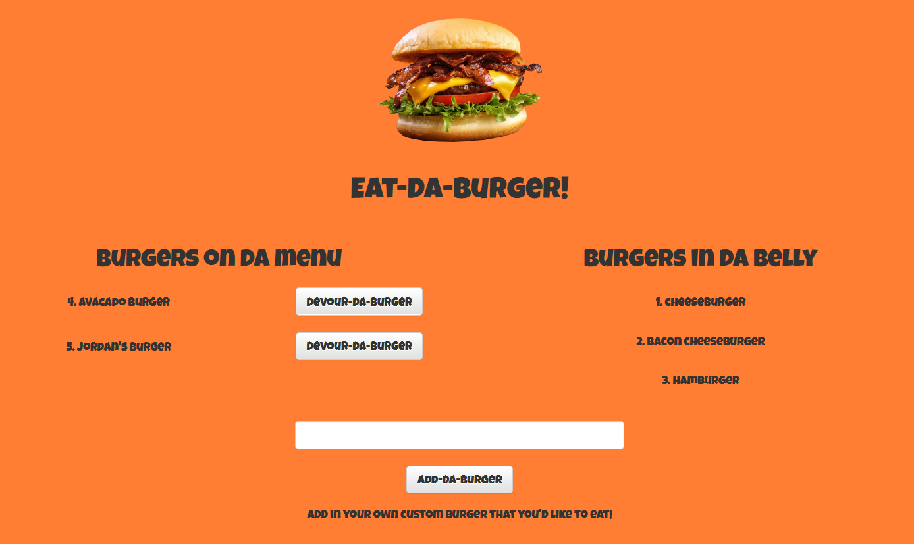

## Eat-Da-Burger!
 Devour a virtual burger and add your own burger for others to devour as well.

## Motivation
To create an app which utilizes a SQL database, an ORM, and follows the MVC design pattern. This burger logger is deployed on Heroku with JawsDB supporting the data.
 
## Screenshots

## Tech/framework used
<b>Built with</b>
- [Node.js](https://nodejs.org/en/)
- [MySQL](https://www.npmjs.com/package/mysql)
- [Express.js](https://www.npmjs.com/package/express)
- [Handlebars.js](https://www.npmjs.com/package/express-handlebars)
- [body-parser](https://www.npmjs.com/package/body-parser)
- [Bootstrap](https://getbootstrap.com/docs/3.3/)
- [JawsDB](https://elements.heroku.com/addons/jawsdb)
- HTML5, CSS3, Javascript

## Features
Google Fonts and Bootsrap provide for a polished UI, and Heroku's hosting combined with JawsDB permit data persistent burgers.

## Installation
- Visit the deployed site at [Eat-Da-Burger]() for immediate use.
- Otherwise, fork and clone the GitHub repo to your machine.
- Ensure that you have Node.js and MySQL installed on your machine
- Set up the database using MySQL to run the schema.sql and seeds.sql files
- If you have a password that protects your MySQL root user, enter that password in the connection.js file in the cloned repo
- In your CLI, navigate to the cloned directory. Install the npm dependencies and start the server.

		npm install

		node server.js

- Eat-Da-Burger runs locally on port 3000. Open your favorite web browser and navigate to localhost:3000 and eat-da-burger!

## Credits
- UNC-CH Coding Boot Camp

## License
MIT © [paulz92](https://github.com/paulz92)
